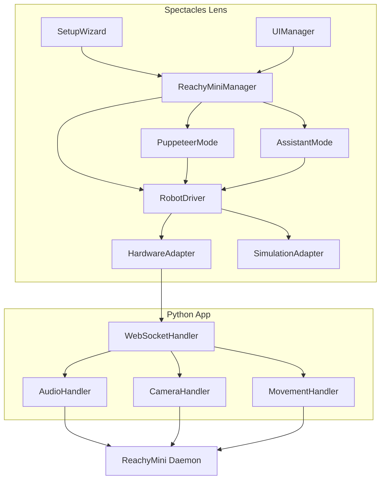

# AR Controller for Reachy Mini

Control the **Reachy Mini** robot via **Augmented Reality Glasses** (Snap Spectacles) in two modes: Puppeteering (directly control the look at target) & Agent (OpenAI ChatGPT with a voice interface that controls the robot via custom tools made available to the LLM)

This repo contains:
- A **Lens Studio** project (the spatial UI for Spectacles, interaction logic and state)
- A **Reachy Mini Python app** that provides and an extended API via **WebSocket** (as opposed to the REST API from the deamon alone)

Aimed to provide an easy starting point for AR developers who would like to start working with hardware / robotics

## Setup

- **Prerequisites**: Snap [Spectacles](https://www.spectacles.com/), any [Reachy Mini](https://huggingface.co/spaces/pollen-robotics/Reachy_Mini) version (this is optional for simulation mode)

1. Start the Reachy Mini [Desktop App](https://huggingface.co/docs/reachy_mini/SDK/quickstart)
Note: this also works with the daemon web interface
2. Locate, install and start the app "spectacles-reachy-mini" (untick official box to find it)
3. Launch the Lens and follow the Setup Wizard:
Note: if you have no rm, select "I ..."
   a) IP (will be saved)
   b) Position (Spatial Anchor)

## Core concepts
- direct control
- agentic mode

extensible 

### Architecture overview

abstraction UI -> Controller (hw and sim) -> reachy app ws -> daemon
extensible
Key decision: all done in Lens -> little dependency on app (intended to only use rest api originally)
adapter pattern

**Lens class diagram**

## Lens Studio Project

`ReachyMiniManager` switches control modes: Puppeteer (look-at draggable target), Assistant (voice + AI), or Setup (connect IP, position robot). 

### Movement
`RobotDriver` computes pose (yaw, pitch, roll, body, antennas) with smoothing and delegates to either `HardwareAdapter` (WebSocket to the robot) or `SimulationAdapter` (scene objects, no robot)
Idle movemen / random

**Animations**
explain system*
add / modify animations

### Puppeteer Mode
look at
extend yourself

### Assistant Mode
llm, tts stt, latency, api keys

#### Tools
link to tools concept
- look_at
- find_object (Object detection from headset view using [Depth Cache](https://github.com/specs-devs/samples/tree/main/Depth%20Cache)
- draw_line
- get_animations / play_animation
- take_picture

how to add your own tools
For example add tools based on [AI Playground](https://github.com/specs-devs/samples/tree/main/AI%20Playground) or [Agentic Playground](https://github.com/specs-devs/samples/tree/main/Agentic%20Playground)

### Simulation

## Reachy Mini App
https://huggingface.co/spaces/V4C38/spectacles_reachy_mini
**Websocket**
**Handlers**
Movement & IK
`MovementHandler` LERPs target toward current at ~30 Hz before sending to `ReachyMini.set_target`, so motion stays smooth over the network.
Audio
Test locally see [Make and publish your Reachy Mini App](https://huggingface.co/blog/pollen-robotics/make-and-publish-your-reachy-mini-apps) 

## Additional Notes
**Development tips**
Set your local ip in reachy mini manager 
**Debug mode**
activate in lens (menu), Print state / tts results
**Known Issues**
ASR Error 0: cause unknown -> restart spectacles to resolve
Spatial anchor / saved position is offset -> reposition

