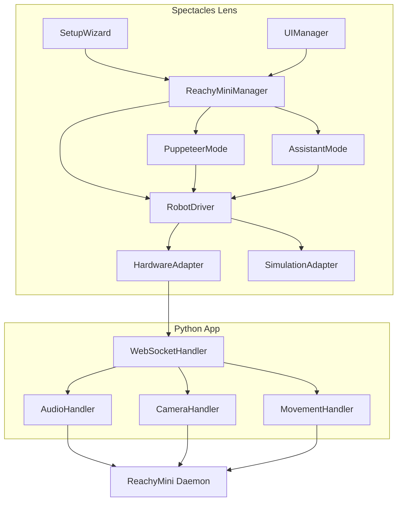

# Spectacles AR + Reachy Mini

Control the **Reachy Mini** robot via **Spectacles AR Glasses** in two modes: Puppeteering (directly control the look at target) & Assistant (OpenAI ChatGPT based Agent with custom tools)

This repo contains:
- A **Lens Studio project** (the spatial UI for Spectacles, interaction logic and state)
- A **Reachy Mini Python app** that provides an extended API via **WebSocket**

This project is an easy starting point for AR developers who would like to venture into the intersection of spatial computing, robotics and AI.

See also the [Demo Video](https://youtu.be/o7Qg9_Oi4b0)

## Setup
**Prerequisites**: Snap [Spectacles](https://www.spectacles.com/), any [Reachy Mini](https://huggingface.co/spaces/pollen-robotics/Reachy_Mini) (supporting both Lite and wireless version)

   *Note: You can also use simulation mode if you do not have the physical robot!*

1. **Start the Reachy Mini [Desktop App](https://huggingface.co/docs/reachy_mini/SDK/quickstart)**
   *If you do not have a Reachy Mini, skip directly to Step 3*
2. Locate, install and **start the App: "spectacles-reachy-mini"** (untick official box to find it)
3. Launch the Lens and **follow the Setup Wizard**

   

   You will be asked to enter the IP of the machine running the Reachy Mini App. This can be on your local network (better latency) or over the internet.
   Select 'I have no Reachy Mini' to enter Simulation Mode.

## Core concepts

There are two main ways of controlling the robot:

**User directly controls the robot:**
This direct control is referred to as **Puppeteer Mode** in this lens: it gives the user a grabbable object that the robot will always look at. This is an easy way to have interactivity.

**An LLM / agent controls the robot:**
A more technically involved approach is what is referred to as **Assistant Mode**, the user can interact with an LLM (ChatGPT) that has custom tools available to move the physical (or simulated) robot.

### Extensibility by Design
This project is designed to be extended by you!
Some suggestions and workflows for this, like adding your own tools for the agent, can be found in later sections. Checkout the `Customization Section` for how to get started!

## Architecture overview
This project is aimed at Lens Studio developers and designers, so almost all of the logic is handled in the Lens itself. This alleviates the need for using python, making it easier to play around and experiment without the complexity of hardware and firmware.

Detailed information about the individual components is provided in the next sections.

Class Diagram

### Lens Studio Project

The central class of the Lens is `ReachyMiniManager`: it sets the control mode: Puppeteer (look-at draggable target) and Assistant (LLM agent with custom tools).

`SetupWizard` (connect IP, position robot) and `UIManager` (the main menu shown while Reachy is paused) will modify and configure the state of `ReachyMiniManager`.

#### Movement

`RobotDriver` computes the pose (yaw, pitch, roll, body, antennas) with smoothing and IK constraints. It then delegates to either `HardwareAdapter` (WebSocket to the robot) or `SimulationAdapter` (scene objects / 3D model) depending on if Reachy Mini is connected or not.

Random movement is applied to all movements to create more lively movement patterns and gives Reachy a personality. The 5 parameters (liveliness, gazeResponsiveness, headHeight, antennaActivity, gazeWander) can be easily configured in `RobotAnimationConfig`.

#### Puppeteer Mode

This implementation is fairly straight forward and computes a look_at pose which is continuously updated at 30 Hz. A target scene object is provided as a reference.
This target object has an `InteractableManipulation` so the user can directly control the robot gaze.

*A good starting point to modifying this project would be to set the lookat target programmatically!*

#### Assistant Mode

An `AssistantConversation` is established (you can think of it as a chat in [ChatGPT within the Lens](https://developers.snap.com/lens-studio/features/remote-apis/chatgpt-api)), the robot is controlled via tools exposed to the agent in `LLMService.ts`. By having access to the camera and depth data of the spectacles as well as it´s own position in the shared 3D space, Reachy can reason surprisingly well about spatial relationships between objects, itself and the user.

Try asking things like "What is the object to my left", "Look at the Teapot" or "Turn around". Take a look at the `systemPrompt` field in `LLMService.ts` to find out more.

An internal state machine determines animation states and what tools can be called:

| State | Behavior |
|---|---|
| **Sleeping** | Head tilted down. ASR listens for wake word. |
| **Idle** | Looks around randomly. Goes to Sleep after 45 seconds. |
| **Listening** | Gazes at the user with a subtle nodding motion. |
| **Speaking** | Gazes at the user with nodding motion. TTS audio is playing. |
| **Searching** | Performs a sweep motion, triggered by the `scan_objects` tool. |

All interaction is handled via two way voice communication inside of `LLMService`. User voice transcription (STT) uses the [ASR Module](https://developers.snap.com/spectacles/about-spectacles-features/apis/asr-module), agent responses use [Snap TTS](https://developers.snap.com/lens-studio/features/voice-ml/text-to-speech)

This setup has some latency but transcription is required to support tool calling, thus a pipeline with audio to audio is not feasible here.

*IMPORTANT NOTE:* You have to set the API tokens in the `RemoteServiceGatewayCredentials` Scene Object within Lens Studio, see [Remote Service Gateway](https://developers.snap.com/lens-studio/features/remote-apis/chatgpt-api)

**Available Tools**

- `get_state` (return both the robot and user head transform in worldspace)
- `look_at` (set the look_at target for Reachy to a vec3 location)
- `draw_line` (draw a line for a duration from startPos to endPos)
- `take_picture_robot_view` (Take a picture from the Reachy camera and add it to the LLMs context)

  *Note: not available in Simulation Mode*

- `scan_objects` (Object detection from headset view using [Depth Cache](https://github.com/specs-devs/samples/tree/main/Depth%20Cache))

  *Note: this tool requires [camera access](https://developers.snap.com/spectacles/about-spectacles-features/apis/camera-module). Since both camera access and internet access prevent publishing the Lens, consider removing this tool if you wish to publish a Lens based on this repo.*

***Adding your own tools***

The `DrawLineTool` is a great example on how this is done in practice and can be used as a reference.
For further guidance, follow these steps:

Step by step guide

1. Create a new file in `lens-studio/Assets/Scripts/Assistant/Tools/` (e.g. `MyCustomTool.ts`)
2. Define a dependencies interface for the dependencies your tool needs
3. Export a `createMyCustomTool(deps)` function that returns a `ToolDefinition` with:
   - `name` — the tool name the LLM will call
   - `description` — explains to the LLM when and how to use the tool
   - `parameters` — JSON Schema describing the arguments
   - `handler` — an async function that receives the args and returns a JSON string
4. Import and register your tool in `ToolFactory.ts`:
   - Import your `createMyCustomTool` function
   - Add a registration block inside `registerTools()` (with dependency guards as needed)
   - Call `llmService.registerTool(createMyCustomTool({ ... }))`

*You could for example add tools based on the [AI Playground](https://github.com/specs-devs/samples/tree/main/AI%20Playground) or [Agentic Playground](https://github.com/specs-devs/samples/tree/main/Agentic%20Playground) templates!*

#### Simulation

This is a fully simulated version of the robot that adheres to the exact same kinematics and (approximated) speeds as the physical robot. 

If simulation mode is enabled, the `RobotDriver` will send all movement commands to `SimulationAdapter` (as opposed to `HardwareAdapter`) which then applies them to the model in the scene.

Simulation mode is entered by selecting "I have no Reachy Mini" in the first step of the setup Wizard. You can at any time switch between the modes by restarting the setup from the main menu.

**Both Puppeteering and Assistant mode are available and work the same as with the physical robot!**

*Note: the tool `take_picture_robot_view` is not available in simulation mode*

### Reachy Mini App

The preferred way to create custom logic for Reachy Mini is by creating a custom app (which is essentially a plugin), see [Reachy Mini Apps](https://huggingface.co/spaces/pollen-robotics/Reachy_Mini#/apps)

This project provides the app **spectacles-reachy-mini** which is already published so you can simply add it inside the Reachy Mini Desktop App.

*Note on why there is an App: The original intention was to only use the Reachy Mini Daemons REST API or Websocket instead of having a custom app for the Reachy Mini App store. This would have reduced complexity by only having a Lens.

Unfortunately the standard API is quite limited (for example no audio playback) as the intention is to use the Python SDK*

#### WebSocket on port 8765

One of the main reasons for the app is to have a WebSocket instead of a REST API for low latency. On the Lens side, we use [the WebSocket API](https://developers.snap.com/spectacles/about-spectacles-features/apis/web-socket).

Available commands:
- `set_target` continuously stream head pose, body yaw, and antenna positions
- `goto` move to a specific pose over a given duration with interpolation
- `stop_move` cancel a `goto` move by UUID
- `play_audio` play base64-encoded raw audio on the robot speaker
- `status` connection health check
- `get_robot_camera_frame` capture a camera frame from the robot (returned as base64)

#### Movement handler

This app is designed to receive continuous movement requests via `set_target` and applies its own smoothing and IK safety checks. The movement update rate is ~30 Hz.
If you want to see the details, they can be found in `movement_handler.py`.

#### Modifying the App itself

Guide and links

If you want to change the app to for example expose more functionality (like named animations), you can find it on [Hugging Face](https://huggingface.co/spaces/V4C38/spectacles_reachy_mini). Feel free to Fork it or create a Pull request.

If you want to test your changes locally without publishing, here is a great guide: [Make and publish your Reachy Mini App](https://huggingface.co/blog/pollen-robotics/make-and-publish-your-reachy-mini-apps)

See also the [Reachy Mini Python SDK](https://huggingface.co/docs/reachy_mini/v1.2.13/en/SDK/python-sdk).

### Customization

Here are some things you can change right away without leaving Lens Studio or writing a lot of code:

- **System prompt:** Edit the `systemPrompt` field in `LLMService.ts` to change the assistant's personality, behavior rules, and tool usage instructions
- **Animation parameters:** Tune the robot's expressiveness (liveliness, gaze responsiveness, antenna activity, etc.) by editing the presets in `RobotAnimationConfig.ts`
- **Add a tool:** Create a new file in `Assets/Scripts/Assistant/Tools/` and register it in `ToolFactory.ts` (see the step-by-step guide above)
- **LLM model:** Change the `model` input on `LLMService` (default: `gpt-4.1-nano`) to use a different OpenAI model or switch over to gemini entirely
- **TTS voice:** Change the `ttsVoice` input on `LLMService` (default: `alloy`) to any [supported voice](https://platform.openai.com/docs/guides/text-to-speech)

Contributions, ideas, and bug reports are more than welcome. Feel free to open an issue or pull request!

### Additional Notes

#### Development tips

- If you upload the Lens from Lens Studio, consider setting Base URL in the `HardwareAdapter` script to your IP so you don't have to type it every time as sometimes the local storage is cleared when re-uploading a Lens.
- In the Lens itself, consider to **enable Logging** (main menu below the Connection Status). This is especially useful when testing the assistant mode as it will show all TTS transcriptions, current agent state, tool calls and LLM responses.

#### Known Issues

- **ASR Error 0** Sometimes TTS can fail on the Spectacles. If it occurs an on screen error is displayed to the user so TTS does not fail silently.
The cause of this is unknown but you can restart the Spectacles to resolve the issue.
