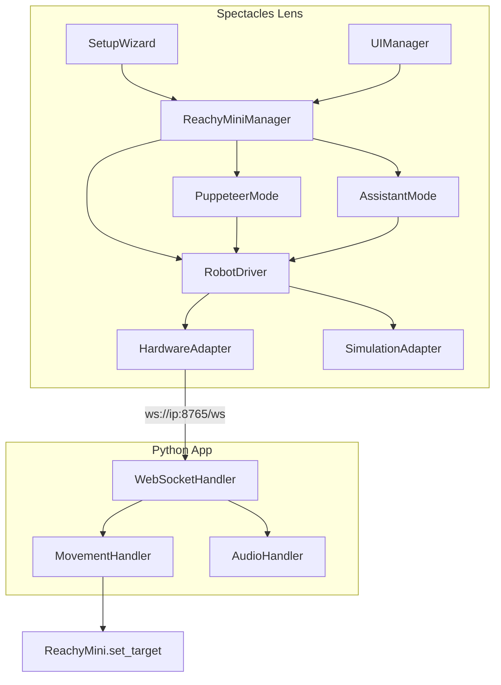

# AR Controller for Reachy Mini

Control **Reachy Mini** from **Snap Spectacles** with an AR interaction flow.

This repo contains:
- A **Lens Studio** project (the Spectacles UI + interaction logic)
- A **Reachy Mini Python app** that runs a **WebSocket bridge** on port **8765**

## Setup (with links)

- **Prerequisites**: Reachy Mini, Snap Spectacles, and both devices on the same local network.

### Running the Python app (Reachy Mini bridge)

1. Start the Reachy Mini daemon (required): see the official [Quickstart](https://huggingface.co/docs/reachy_mini/SDK/quickstart)
   - **USB (Lite)**: `uv run reachy-mini-daemon`
   - **Simulation**: `uv run reachy-mini-daemon --sim` (or `mjpython -m reachy_mini.daemon.app.main --sim` on macOS)
   - **Wireless**: the daemon runs when the robot is powered on
2. Verify the daemon by opening `http://localhost:8000` (Reachy Dashboard).
3. Install this app (use the same Python environment as the daemon):

```bash
cd reachy-mini-app
pip install -e .
```

4. In the dashboard, start **Spectacles AR controller**.
5. Open `http://[your-ip]:8765/` to see the IP to enter on Spectacles. The Lens connects to `ws://[your-ip]:8765/ws`.

For background on the daemon/SDK architecture and frames, see [Core Concepts](https://huggingface.co/docs/reachy_mini/SDK/core-concept).

### Deploying the Lens (Spectacles)

Open the Lens Studio project, deploy to Spectacles, and in the setup wizard enter the IP shown by the Python app page above.

**Links**
- [Lens Studio project](lens-studio/)
- [Python Reachy Mini app](reachy-mini-app/)

## Architecture overview

**Core concepts**

The Lens uses an **adapter pattern**: `RobotDriver` computes pose (yaw, pitch, roll, body, antennas) with smoothing and delegates to either `HardwareAdapter` (WebSocket to the robot) or `SimulationAdapter` (scene objects, no robot). `ReachyMiniManager` switches control modes: Puppeteer (look-at draggable target), Assistant (voice + AI), or Setup (connect IP, position robot). On the Python side, `MovementHandler` LERPs target toward current at ~30 Hz before sending to `ReachyMini.set_target`, so motion stays smooth over the network.

**Lens class diagram**



**Layer roles**

| Layer | Role |
|---|---|
| ReachyMiniManager | Mode orchestrator (0=inactive, 1=Puppeteer, 2=Assistant) |
| PuppeteerMode | Look-at draggable target; calls `RobotDriver.lookAt` + `updateFrame` per frame |
| AssistantMode | Wake word, ASR, LLM, object detection; drives gaze and plays audio via `RobotDriver` |
| RobotDriver | Pose computation (`anglesToTarget`, smoothing), delegates to active adapter |
| HardwareAdapter | WebSocket client; sends `set_target`/`goto` to Python |
| SimulationAdapter | Applies pose to scene objects with LERP; no network |
| MovementHandler | Target/current LERP at ~30 Hz, velocity limits, sends to SDK |

